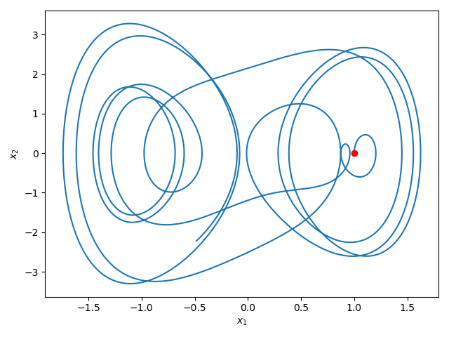

Python Systems Library (PSL)

PSL is a minimalistic library for simulating dynamical systems in Python
using [SciPy](https://scipy.org/) library.

Authors: Jan Drgona, Aaron Tuor, Stefan Dernbach, 
James Koch, Soumya Vasisht, Wenceslao Shaw Cortez, Draguna Vrabie

# Installation

## pip
``` bash
python3 -m venv venv
source venv/bin/activate
python3 -m pip install .
```

## Conda
```console
$ conda create -n psl python=3.8
$ conda activate psl
(psl) $ conda install numpy
(psl) $ conda install scipy
(psl) $ conda install matplotlib
(psl) $ pip install pyts
(psl) $ pip install tqdm
```

# Documentation

See online [Documentation](https://pnnl.github.io/psl/).

# Syntax and Use
```python
import psl
# instantiate selected dynamical system model
model = psl.systems['Duffing'](ts=0.01)
# simulate the dynamical system over nsim steps
out = model.simulate(nsim=2000)
# plot time series and phase portrait 
psl.plot.pltOL(Y=out['Y'], X=out['X'])
psl.plot.pltPhase(X=out['Y'])
```




# Examples

See folder [tests](/tests).

